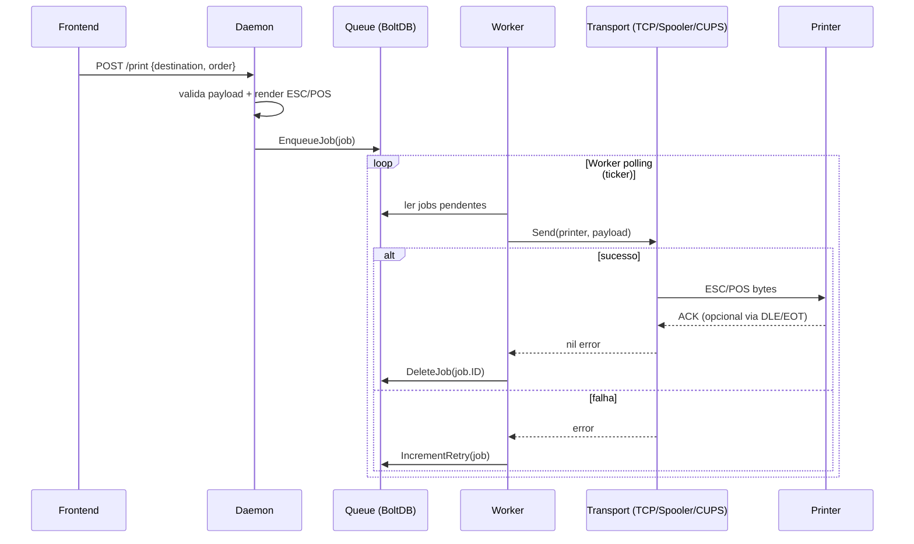
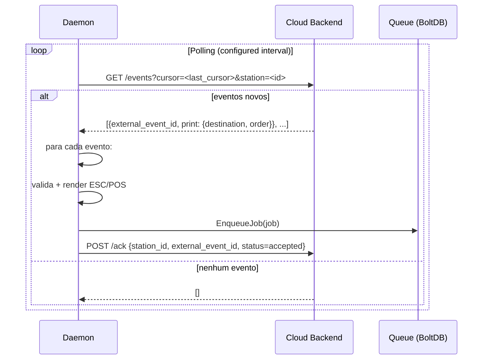

# Arquitetura do Daemon de Impressão PDV

## Visão geral

O daemon de impressão (`pdv-printer-daemon`) é um serviço Go que roda localmente na máquina do estabelecimento (Windows ou Linux) e é responsável por receber solicitações de impressão, gerar os comandos ESC/POS necessários e enviá‑los para a impressora térmica de forma confiável.

Ele substitui a abordagem anterior em que o frontend enviava diretamente os dados para a impressora via TCP, trazendo os seguintes benefícios:

* **Persistência local** – fila em SQLite sobrevive a reinicializações.
* **Independência do frontend** – o worker continua tentando mesmo com o navegador fechado.
* **Proteção contra duplicidade** – chave única (`order_id + destination`) evita impressão acidental do mesmo pedido.
* **Tratamento prudente de falhas** – falhas de conexão são repetidas com back‑off exponencial; falhas de escrita ficam em estado de *reprint_confirmation* evitando duplicação automática quando parte do cupom pode já ter sido recebida.
* **Templates editáveis** – layout pode ser alterado sem recompilar o binário.
* **Serviço nativo** – registra como serviço no Windows e usa systemd no Linux.
* **Diagnóstico** – endpoints `/health`, `/api/jobs` e `/api/printers/status` fornecem base para tela de suporte.

## Componentes principais

```mermaid
flowchart TD
    %% External actors
    subgraph External[External Systems]
        direction TB
        Frontend[(Frontend<br/>(React/Tauri ou navegador))]
        Cloud[Backend Cloud<br/>(API de eventos)]
    end

    %% Daemon internals
    subgraph Daemon[PDV Printer Daemon]
        direction TB
        API[HTTP API Server] -->|POST /print| Queue[Persistent Queue (BoltDB)]
        Queue --> Worker[Background Worker]
        Worker --> Transport[Transport Layer<br/>(TCP / Windows Spooler / CUPS)]
        Transport -->|ESC/POS| Printer[(Thermal Printer)]
        Worker -->|status| StatusReporter[(Status Reporting)]
        API -->|GET /health| External
        API -->|GET /api/jobs| External
        API -->|GET /api/printers/status| External
        Cloud -->|polling (outbox)| CloudClient[Cloud Polling Client]
        CloudClient -->|acknowledge| Cloud
        CloudClient -->|enqueue| Queue
    end

    %% Configuration & data
    subgraph Config[Configuration & Persistence]
        direction TB
        ConfigFile[config.json] -->|read at startup| Daemon
        Queue -->|SQLite file| DB[(spooler.db)]
        Logs[log files] --> Daemon
    end

    %% Styling
    classDef external fill:#f9f,stroke:#333,stroke-width:2px;
    classDef daemon fill:#bbf,stroke:#333,stroke-width:2px;
    classDef config fill:#bfb,stroke:#333,stroke-width:2px;
    class External external;
    class Daemon daemon;
    class Config config;
```

### Fluxo de dados

1. **Entrada de trabalho**
   * O frontend (ou o backend cloud via polling) faz uma requisição `POST /print` contendo:
     * `destination` – identificador lógico da impressora (ex.: `kitchen`, `counter`).
     * `order` – objeto completo do pedido (itens, observações, pagamento, etc.).
   * O daemon valida o payload, renderiza o template ESC/POS correspondente e cria um **job** contendo:
     * `ID` – UUID gerado localmente (`job-<timestamp>`).
     * `Printer` – destino lógico.
     * `Payload` – bytes ESC/POS prontos para transmissão.
     * `Retries` – contador de tentativas.
     * `CreatedAt` – timestamp de criação.

2. **Enfileiramento persistente**
   * O job é gravado de forma atômica em um bucket BoltDB (`print_jobs`) usando a função `EnqueueJob`.
   * A chave do bucket é o `ID` do job; assim, tentativas de reenvio com o mesmo `ID` são tratadas como atualização (idempotência).

3. **Processamento em background**
   * Um goroutine worker acorda a cada 2 segundos (ticker) e:
     * Lê todos jobs pendentes do BoltDB.
     * Para cada job, chama `transport.Send(printerName, payload)`.
     * Se o envio for bem‑sucedido, o job é removido da fila (`DeleteJob`).
     * Em caso de falha, o campo `Retries` é incrementado e o job é reinserido (`IncrementRetry`) para nova tentativa após o back‑off configurado.

4. **Camada de transporte**
   * Abstração que permite múltiplos backends:
     * **TCP** – conexão direta a `host:porta` (padrão histórico).
     * **Windows Spooler (RAW)** – usa a API de impressão do Windows (`OpenPrinter`, `StartDocPrinter`, `WritePrinter`, etc.) com `pDatatype = "RAW"` para enviar ESC/POS sem interpretação do driver.
     * **CUPS (Linux)** – envio RAW via fila configurada no CUPS (IPP/Unix socket ou comando `lp -o raw`).

   * Cada backend implementa a interface:
     ```go
     type Transport interface {
         Send(ctx context.Context, printer string, data []byte) error
         Status(ctx context.Context) PrinterStatus
     }
     ```

5. **Relatório de status**
   * Após cada tentativa (seja sucesso ou falha), o worker pode atualizar o status do job em uma estrutura externa (ex.: tabela `external_events` usada para sincronização com o backend cloud).
   * O endpoint `/api/printers/status` agrega os últimos status conhecidos por destino.

6. **Sincronização com a nuvem (opcional)**
   * Quando configurado, o daemon abre uma conexão de saída persistente para o backend cloud (polling ou WebSocket/SSE iniciado pelo daemon).
   * Busca novos eventos de impressão (`external_event_id`), deduplica, converte em jobs e coloca na fila local.
   * Após processamento, envia acknowledgment contendo o status (`sent_to_printer`, `retry_waiting`, `reprint_confirmation`, etc.).

## Pontos de extensão

* **Novos transportes** – basta implementar a interface `Transport` e registrar no mapa de backends (`NewTransport()`).
* **Novos templates** – adicionar arquivos JSON em `printer/templates/` e referenciá‑los pelo nome no `config.json`.
* **Métricas e tracing** – os pontos de entrada/saída do worker são bons locais para coletar latência, taxa de sucesso, etc.
* **WebSocket interno** – para notificação em tempo real ao frontend local (ex.: toast de impressão concluída).

## Requisitos de sistema

| Recurso | Mínimo | Recomendado |
|---------|--------|-------------|
| Sistema operacional | Windows 10/11 (x64) ou Linux (distro com systemd) | Mesma |
| Arquitetura | amd64 | amd64 |
| Memória RAM | 64 MB | 128 MB |
| Espaço em disco | 10 MB (binário + logs) | 50 MB (para logs rotativos) |
| Dependências externas | Nenhuma (todos os pacotes Go são vendidos via módulo) | — |
| Porta TCP (se usado) | 8080 (configurável) | — |
| Acesso à impressora | Permissão para abrir porta TCP ou acessar fila de impressão | — |

## Segurança

* **Escuta em `127.0.0.1` por padrão** – somente processos locais podem se conectar ao daemon.
* **Token de autenticação opcional** – se configurado, todas as rotas exceto `/health` exigem `Authorization: Bearer <token>`.
* **Validação rígida de payload** – limites de tamanho de campos, rejeição de destinos e templates desconhecidos.
* **Logs sem dados sensíveis** – nunca são gravados números de cartão, CPFs, etc., a menos que explicitamente permitido pelo template.
* **Atualização assíncrona** – o verificador de update baixa o artefato em um arquivo temporário, valida checksum e assinatura Minisign antes de substituir o binário em operação atômica.

## Fluxo de atualização (auto‑update)

1. O daemon consulta periodicamente (a cada 24h) um manifesto JSON hospedado no servidor de updates.
2. O manifesto contém, por sistema/arquitetura:
   * URL do binário compactado (`.zip` ou `.tar.gz`).
   * SHA‑256 esperada.
   * Assinatura Minisign (opcional, chave configurada localmente).
3. Se houver nova versão, o binário é baixado, validado e, se aprovado, substituído.
4. Em seguida, o daemon dispara um comando de reinicialização específico do SO:
   * Windows: `net stop pvpd && net start pvpd`
   * Linux: `systemctl restart pvpd.service`
5. O processo antigo é encerrado graciosamente (shutdown handler captura SIGINT/SIGTERM).

## Diagramas de sequência

### Sequência de impressão (frontend → daemon → impressora)



### Sequência de polling da nuvem (daemon → cloud)



## Conclusão

O daemon de impressão centraliza a responsabilidade de impressão em um serviço local confiável, oferecendo tolerância a falhas, persistência e flexibilidade de transporte. Sua arquitetura modular permite a fácil adição de novos backends de impressão (USB direto, outros spoolers, etc.) e novos mecanismos de comunicação com a nuvem, mantendo o núcleo de enfileiramento e renderização estável e bem testado.

Para maiores detalhes de configuração, consulte o arquivo `config.example.json` e o README em `printer/README.md`.