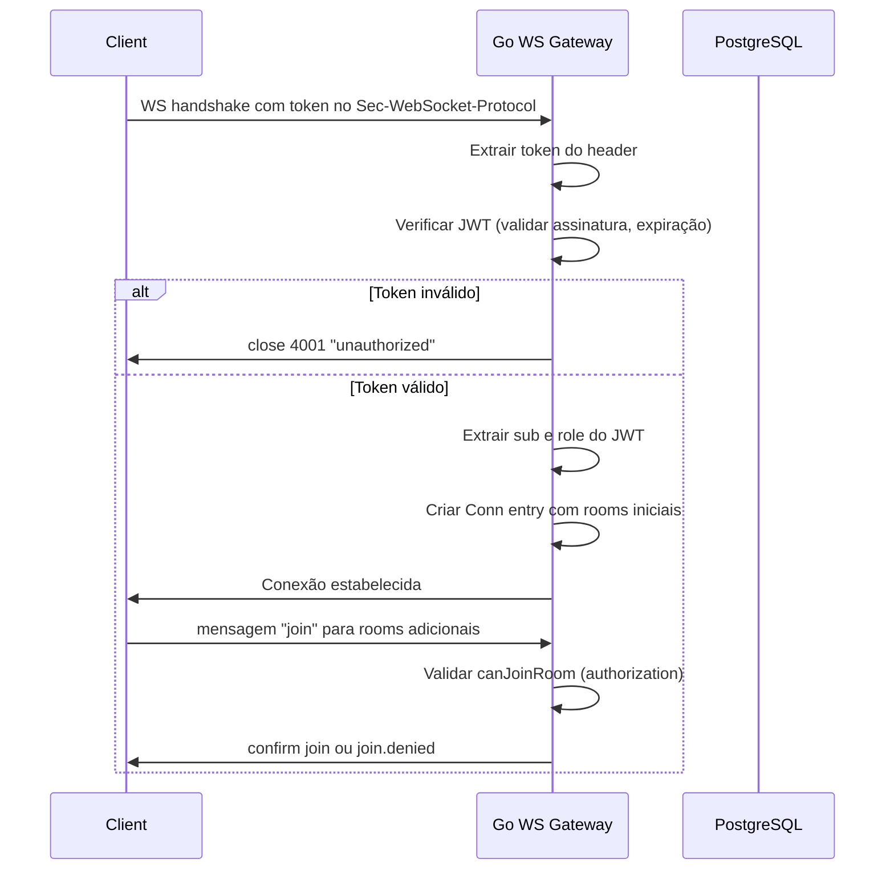
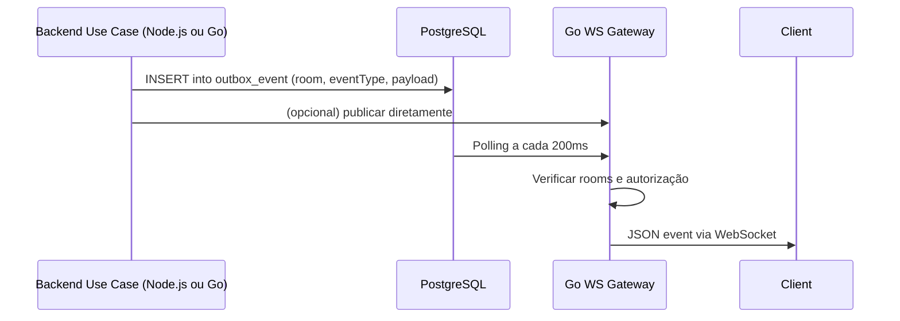

# Go WebSocket Gateway — Planejamento e Especificação

## Visão Geral

Substituir a responsabilidade de gerenciamento de conexões WebSocket do backend Node.js (`backend/src/infra/realtime/`) por um serviço em **Go**, responsável exclusivamente por:

- Gerenciar conexões WebSocket (aceitar, manter, remover)
- Gerenciar rooms (entrar/sair)
- Broadcast de eventos para rooms
- Autenticação JWT via WebSocket subprotocol
- Persistência de eventos (integração com outbox ou polling do PostgreSQL)

Este gateway será um serviço autônomo que se conecta ao mesmo PostgreSQL usado pelo backend Node.js, compartilhando o mesmo banco de dados para o padrão outbox.

---

## Arquitetura

```
┌─────────────────────────────────────────────────────────────────┐
│                    CLIENTES (Frontend/Tablets)                 │
│  WS → ws://host:8080/realtime (subprotocol: JWT token)         │
└─────────────────────────────────────┬─────────────────────────┘
                                      │
                                      │ WebSocket connections
                                      ▼
┌─────────────────────────────────────────────────────────────────┐
│                    GO WS GATEWAY                                 │
│  Puerto: 8080                                                   │
│  └─ wsConnManager    │ Gerencia conexões ativas                 │
│  └─ roomManager      │ Gerencia rooms por assinante             │
│  └─ broadcast        │ Envia eventos para rooms               │
│  └─ auth             │ Verifica JWT no handshake              │
│  └─ db               │ PostgreSQL (outbox, queries)           │
└─────────────────────────────────────┬─────────────────────────┘
                                      │
                                      │ PostgreSQL queries / outbox
                                      ▼
┌─────────────────────────────────────────────────────────────────┐
│                    POSTGRESQL                                     │
│  Tabelas: outbox_event, order, order_item, etc.                │
└─────────────────────────────────────────────────────────────────┘
```

---

## Componentes Principais

### 1. `wsConnManager` — Gerenciador de Conexões

Responsabilidades:
- Rastrear todas as conexões WebSocket ativas
- Associar cada conexão ao usuário autenticado (sub do JWT)
- Remover conexões quando o client desconecta
- Fornecer interface para broadcast e room management

**Estrutura de dados:**

```go
type Conn struct {
    Socket    *websocket.Conn
    UserID    string // sub do JWT
    Role      string // papel do usuário (waiter, kitchen, manager, cashier, courier)
    Rooms     map[string]bool
    ConnectAt time.Time
}

type WSConnManager struct {
    // Muutex para thread-safe access
    mu sync.RWMutex
    // conexões indexadas por UUID único
    connections map[string]*Conn
    // mapeamento reverse: userID -> set de connection IDs
    userConnections map[string]map[string]bool
}
```

**Métodos principais:**

- `Add(socket *websocket.Conn, userID, role string) string` — adiciona conexão, retorna ID
- `Remove(id string)` — remove conexão e limpa rooms
- `GetUserConnections(userID string) []*Conn` — retorna conexões de um usuário
- `BroadcastToRoom(room string, message []byte)` — envia para todas as conexões em um room

---

### 2. `roomManager` — Gerenciador de Rooms

Responsabilidades:
- Gerenciar quais rooms cada conexão pertence
- Validar se um usuário pode entrar em um room (authorization)
- Fornecer métodos convenientes para os casos de uso

**Rooms suportados (mapeamento do Node.js):**

| Room | Who can join | Purpose |
|---|---|---|
| `waiter:{userId}` | Apenas o próprio garçom | Eventos diretos ao garçom |
| `kitchen-display` | kitchen, manager | Tela da cozinha |
| `cash-drawer` | cashier, manager | Fluxo de caixa |
| `deliveries` | manager, courier | Entregas |
| `inventory` | manager | Estoque |
| `alerts` | todos os perfis com audiência | Sino da casca |
| `alerts:{role}` | próprio papel | Alerta direcionado |
| `alertsUserRoomFor:{sub}` | próprio usuário | Alerta direcionado por usuário |

**Métodos principais:**

- `CanJoin(userRole, userSub, room string) bool` — verifica autorização (mimic da função `canJoinRoom` do Node.js)
- `Join(conn *Conn, room string) error` — adiciona conexão a room
- `Leave(conn *Conn, room string)` — remove conexão de room
- `GetRoomMembers(room string) []string` — lista conexões em um room

---

### 3. `broadcast` — Envio de Eventos

Responsabilidades:
- Enviar mensagem JSON para todas as conexões em um room
- Tratar conexões fechadas gracefully
- Log de broadcasts para debugging

**Formato da mensagem (compatível com o Node.js):**

```json
{
  "type": "order.item.created",
  "payload": { ... },
  "emittedAt": "2026-01-15T10:30:00Z",
  "correlationId": "optional"
}
```

---

### 4. `auth` — Autenticação JWT

Responsabilidades:
- Extrair token do header `Sec-WebSocket-Protocol`
- Verificar assinatura e validade do JWT
- Retornar informações do usuário (sub, role)

**Fluxo de handshake:**

1. Client conecta: `ws://host:8080/realtime`
2. Client oferece token como subprotocol: `new WebSocket(url, [token])`
3. Server extrai o primeiro protocolo oferecido
4. Server verifica o JWT (mesma lógica do `verifyTokenRaw` do Node.js)
5. Se inválido, close com código 4001
6. Se válido, adiciona conexão ao manager com as rooms iniciais

---

### 5. `db` — Integração com PostgreSQL

Responsabilidades:
- Polling do outbox pattern (alternativa ao `outbox-dispatcher` do Node.js)
- Queries para obter dados atuais quando necessário
- Inserção de eventos no outbox (se este gateway for a fonte única)

**Polling strategy (a cada 200ms, igual ao Node.js):**

```go
func pollOutboxOnce() error {
    // Buscar eventos pendentes orderBy createdAt, seq
    // Broadcast para rooms apropriados
    // Marcar como published
}
```

**Nota:** Este gateway pode ser o único responsável pelo outbox, ou coexistir com o dispatcher do Node.js durante uma transição gradual.

---

## Fluxo de Autenticação e Conexão



---

## Fluxo de Broadcast de Eventos



---

## Implementação Detalhada

### Estrutura de Pastas (Go módulo)

```
go-ws-gateway/
├── cmd/
│   └── gateway/          # ponto de entrada main.go
├── internal/
│   ├── connmanager/      # wsConnManager
│   ├── roommanager/      # roomManager
│   ├── broadcast/        # broadcast logic
│   └── auth/             # JWT authentication
├── pkg/
│   └── websocket/        # wrappers ou utils para websocket
├── go.mod
└── go.sum
```

### Dependências Go

```go
require (
    github.com/gorilla/websocket v1.5.0  # ou stdlib net/http/websocket
    github.com/dgrijalva/jwt-go/v5 v5.0.0
    github.com/lib/pq v1.10.8
)
```

### Points de Integração com o Existemete Node.js Backend

Durante a transição, considerar:

1. **Banco de dados compartilhado**: O gateway Go usa o mesmo PostgreSQL do Node.js
2. **Outbox pattern**: O gateway pode assumir o polling do outbox, ou coexistir
3. **Rotas HTTP existentes**: As rotas HTTP continuam no Node.js backend; apenas o WS é migrado
4. **Feature flag**: Durante o deploy, usar feature flag para alternar entre WS do Node.js e Go gateway

### Considerações de Deploy

- **Dockerfile**: Build multi-stage com `golang:1.23` + `distroless` ou `alpine`
- **Porta**: 8080 (ou variável de ambiente `WS_GATEWAY_PORT`)
- **Dependências de ambiente**:
  - `DATABASE_URL` (mesmo do Node.js)
  - `JWT_SECRET` (mesmo do Node.js auth middleware)
  - `WS_GATEWAY_ORIGIN` (origem permitida para CORS se necessário)
- **Health check**: `GET /health` que responde `200` se o banco está conectado

---

## Mapeamento de Rooms (Go vs Node.js)

Tabela de conversão para garantir compatibilidade:

| Node.js Room | Go Room | Observação |
|---|---|---|
| `waiter:${userId}` | `waiter:${userId}` | Igual |
| `kitchen-display` | `kitchen-display` | Igual |
| `cash-drawer` | `cash-drawer` | Igual |
| `deliveries` | `deliveries` | Igual |
| `inventory` | `inventory` | Igual |
| `alerts` | `alerts` | Igual |
| `alerts:${role}` | `alerts:${role}` | Igual |
| `alertsUserRoomFor:${sub}` | `alertsUserRoomFor:${sub}` | Igual |

A função `canJoinRoom` do Node.js deve ser reescrita em Go com a mesma lógica:

```go
func canJoinRoom(role, sub, room string) bool {
    // Lógica idêntica ao Node.js:
    // - waiter:${sub}: só o próprio
    // - alerts / alerts:${role}: próprio papel
    // - alertsUserRoomFor:${sub}: próprio usuário
    // - roles específicos por permissões
}
```

---

## Migração Gradual

### Fase 1: Paralelo
- Manter WS do Node.js ativo
- Deploy do Go gateway em paralelo (porta diferente)
- Feature flag: `WS_BACKEND=node|go`
- Monitorar métricas de conexão

### Fase 2: Cutover
- Ativar `WS_BACKEND=go` por gradativo
- Desconectar clients e reconectar (ou reconnect automaticamente via JS)
- Desabilitar WS do Node.js

### Fase 3: Remoção
- Remover código WS do Node.js
- Remover `outbox-dispatcher` do Node.js (ou deixar como backup)
- Ajustar event publishers para apontar para o Go gateway

---

## Segurança

1. **JWT no subprotocol**: Nunca na query string (evita vazamento em logs)
2. **Validação rigorosa**: Mesma lógica do `verifyTokenRaw` do Node.js
3. **Room authorization**: Mesmo recorte do `canJoinRoom` — impedir que garçom entre em `deliveries` de outro, etc.
4. **Conexão limitada**: Número máximo de conexões por usuário/session
5. **TLS em produção**: Terminar TLS no Caddy/reverse proxy, o gateway Go escuta HTTP interno

---

## Exemplos de Uso

### Conexão do Client (JavaScript)

```javascript
// O token vem do login REST, enviado como subprotocol
const token = sessionStorage.getItem('jwt_token');
const ws = new WebSocket('ws://localhost:8080/realtime', [token]);

ws.onopen = () => {
    // Entrar nas rooms iniciais já definidas no handshake
    // Entrar em rooms adicionais via join message
    ws.send(JSON.stringify({ type: 'join', room: 'kitchen-display' }));
};

ws.onmessage = (evt) => {
    const msg = JSON.parse(evt.data);
    // Dispatcher para handlers baseado em msg.type
};
```

### Publicação de Evento (do backend Go ou Node.js)

```go
// Do backend Go - publicar evento para room
func publishEvent(room string, eventType string, payload interface{}) {
    msg := map[string]interface{}{
        "type":       eventType,
        "payload":    payload,
        "emittedAt":  time.Now().UTC().Format(time.RFC3339),
    }
    gw.BroadcastToRoom(room, json.Marshal(msg))
}

// Ou inserir no outbox para polling
func enqueueEvent(room, eventType, payload interface{}) error {
    // INSERT into outbox_event
    // O dispatcher do gateway pegará isso no próximo polling cycle
}
```

---

## Checklist de Implantação

- [ ] Estrutura de pastas Go criada
- [ ] Módulo `go.mod` configurado com dependências
- [ ] `wsConnManager` implementado com thread-safety
- [ ] `roomManager` com `CanJoinRoom` idêntico ao Node.js
- [ ] Autenticação JWT via subprotocol
- [ ] Broadcast para rooms funcionando
- [ ] Polling do outbox pattern (a cada 200ms)
- [ ] Health check endpoint
- [ ] Dockerfile para build e run
- [ ] Variáveis de ambiente documentadas
- [ ] Testes unitários para cada componente
- [ ] Integração com o frontend existente testada
- [ ] Feature flag para transição gradual
- [ ] Monitoramento/logs de conexões e errors

---

## Próximos Passos

1. Criar o repositório Go módulo
2. Implementar `wsConnManager` básico
3. Implementar autenticação JWT
4. Implementar room management com authorization
5. Implementar broadcast funcional
6. Integrar com o banco de dados (polling outbox)
7. Testar conectividade com o frontend existente
8. Deploy em ambiente de staging