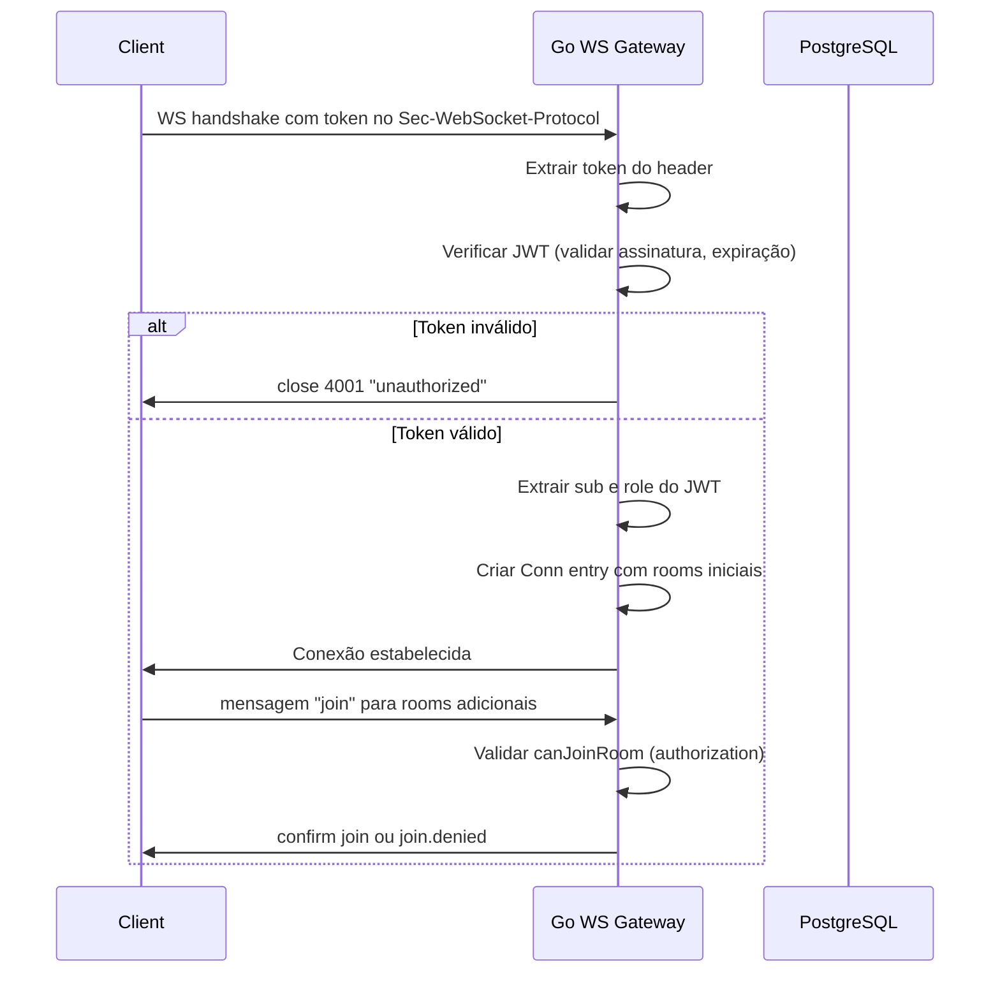
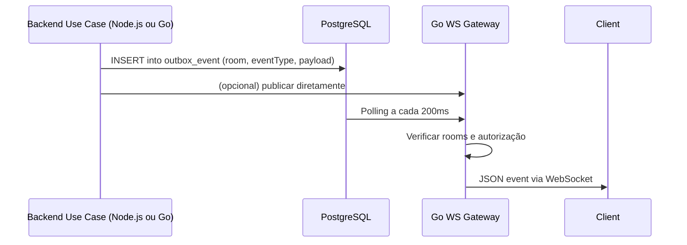

# Go WebSocket Gateway — Planejamento e Especificação

## Visão Geral

Substituir a responsabilidade de gerenciamento de conexões WebSocket do backend Node.js (`backend/src/infra/realtime/`) por um serviço em **Go**, responsável exclusivamente por:

- Gerenciar conexões WebSocket (aceitar, manter, remover)
- Gerenciar rooms (entrar/sair)
- Broadcast de eventos para rooms
- Autenticação JWT via WebSocket subprotocol
- Persistência de eventos (integração com outbox ou polling do PostgreSQL)

Este gateway será um serviço autônomo que se conecta ao mesmo PostgreSQL usado pelo backend Node.js, compartilhando o mesmo banco de dados para o padrão outbox.

---

## Arquitetura

```
┌─────────────────────────────────────────────────────────────────┐
│                    CLIENTES (Frontend/Tablets)                 │
│  WS → ws://host:8080/realtime (subprotocol: JWT token)         │
└─────────────────────────────────────┬─────────────────────────┘
                                      │
                                      │ WebSocket connections
                                      ▼
┌─────────────────────────────────────────────────────────────────┐
│                    GO WS GATEWAY                                 │
│  Puerto: 8080                                                   │
│  └─ wsConnManager    │ Gerencia conexões ativas                 │
│  └─ roomManager      │ Gerencia rooms por assinante             │
│  └─ broadcast        │ Envia eventos para rooms               │
│  └─ auth             │ Verifica JWT no handshake              │
│  └─ db               │ PostgreSQL (outbox, queries)           │
└─────────────────────────────────────┬─────────────────────────┘
                                      │
                                      │ PostgreSQL queries / outbox
                                      ▼
┌─────────────────────────────────────────────────────────────────┐
│                    POSTGRESQL                                     │
│  Tabelas: outbox_event, order, order_item, etc.                │
└─────────────────────────────────────────────────────────────────┘
```

---

## Componentes Principais

### 1. `wsConnManager` — Gerenciador de Conexões

Responsabilidades:
- Rastrear todas as conexões WebSocket ativas
- Associar cada conexão ao usuário autenticado (sub do JWT)
- Remover conexões quando o client desconecta
- Fornecer interface para broadcast e room management

**Estrutura de dados:**

```go
type Conn struct {
    Socket    *websocket.Conn
    UserID    string // sub do JWT
    Role      string // papel do usuário (waiter, kitchen, manager, cashier, courier)
    Rooms     map[string]bool
    ConnectAt time.Time
}

type WSConnManager struct {
    // Muutex para thread-safe access
    mu sync.RWMutex
    // conexões indexadas por UUID único
    connections map[string]*Conn
    // mapeamento reverse: userID -> set de connection IDs
    userConnections map[string]map[string]bool
}
```

**Métodos principais:**

- `Add(socket *websocket.Conn, userID, role string) string` — adiciona conexão, retorna ID
- `Remove(id string)` — remove conexão e limpa rooms
- `GetUserConnections(userID string) []*Conn` — retorna conexões de um usuário
- `BroadcastToRoom(room string, message []byte)` — envia para todas as conexões em um room

---

### 2. `roomManager` — Gerenciador de Rooms

Responsabilidades:
- Gerenciar quais rooms cada conexão pertence
- Validar se um usuário pode entrar em um room (authorization)
- Fornecer métodos convenientes para os casos de uso

**Rooms suportados (mapeamento do Node.js):**

| Room | Who can join | Purpose |
|---|---|---|
| `waiter:{userId}` | Apenas o próprio garçom | Eventos diretos ao garçom |
| `kitchen-display` | kitchen, manager | Tela da cozinha |
| `cash-drawer` | cashier, manager | Fluxo de caixa |
| `deliveries` | manager, courier | Entregas |
| `inventory` | manager | Estoque |
| `alerts` | todos os perfis com audiência | Sino da casca |
| `alerts:{role}` | próprio papel | Alerta direcionado |
| `alertsUserRoomFor:{sub}` | próprio usuário | Alerta direcionado por usuário |

> O nome do room é o que vai no cable, não o nome da função: em
> `alert.usecases.ts`, `alertsUserRoomFor(sub)` devolve `alerts:user:{sub}` (é
> `alerts:${alertUserToken(sub)}`, e `alertUserToken` = `user:${id}`). No Go isso
> é `roommanager.AlertsUserRoomFor(sub)`. A tabela de rooms do `AGENTS.md` não
> cita o room por usuário — ele entra no handshake de **todos** os perfis.

**Métodos principais:**

- `CanJoin(userRole, userSub, room string) bool` — verifica autorização (mimic da função `canJoinRoom` do Node.js)
- `Join(conn *Conn, room string) error` — adiciona conexão a room
- `Leave(conn *Conn, room string)` — remove conexão de room
- `GetRoomMembers(room string) []string` — lista conexões em um room

---

### 3. `broadcast` — Envio de Eventos

Responsabilidades:
- Enviar mensagem JSON para todas as conexões em um room
- Tratar conexões fechadas gracefully
- Log de broadcasts para debugging

**Formato da mensagem (compatível com o Node.js):**

```json
{
  "type": "order.item.created",
  "payload": { ... },
  "emittedAt": "2026-01-15T10:30:00Z",
  "correlationId": "optional"
}
```

---

### 4. `auth` — Autenticação JWT

Responsabilidades:
- Extrair token do header `Sec-WebSocket-Protocol`
- Verificar assinatura e validade do JWT
- Retornar informações do usuário (sub, role)

**Fluxo de handshake:**

1. Client conecta: `ws://host:8080/realtime`
2. Client oferece token como subprotocol: `new WebSocket(url, [token])`
3. Server extrai o primeiro protocolo oferecido
4. Server verifica o JWT (mesma lógica do `verifyTokenRaw` do Node.js)
5. Se inválido, close com código 4001
6. Se válido, adiciona conexão ao manager com as rooms iniciais

---

### 5. `db` — Integração com PostgreSQL

Responsabilidades:
- Polling do outbox pattern (alternativa ao `outbox-dispatcher` do Node.js)
- Queries para obter dados atuais quando necessário
- Inserção de eventos no outbox (se este gateway for a fonte única)

**Polling strategy (a cada 200ms, igual ao Node.js):**

```go
func pollOutboxOnce() error {
    // Buscar eventos pendentes orderBy createdAt, seq
    // Broadcast para rooms apropriados
    // Marcar como published
}
```

**Nota:** Este gateway pode ser o único responsável pelo outbox, ou coexistir com o dispatcher do Node.js durante uma transição gradual.

---

## Fluxo de Autenticação e Conexão



---

## Fluxo de Broadcast de Eventos



---

## Implementação Detalhada

### Estrutura de Pastas (Go módulo)

```
go-ws-gateway/
├── cmd/
│   └── gateway/          # ponto de entrada main.go
├── internal/
│   ├── connmanager/      # wsConnManager
│   ├── roommanager/      # roomManager
│   ├── broadcast/        # broadcast logic
│   └── auth/             # JWT authentication
├── pkg/
│   └── websocket/        # wrappers ou utils para websocket
├── go.mod
└── go.sum
```

### Dependências Go (o que o `go.mod` tem)

```
require (
    github.com/golang-jwt/jwt/v5   // verificação do JWT (o plano original previa o dgrijalva/jwt-go)
    github.com/gorilla/websocket    // o handshake e o hijack do WebSocket
    github.com/lib/pq               // driver do Postgres (indireto, via database/sql)
)
```

> Nenhum módulo de instrumentação. O plano original citava um `pkg/websocket` de wrappers; o que
> existe é `internal/connmanager` + `internal/roommanager` (ver a nota de nomenclatura no
> checklist).

### Points de Integração com o Existemete Node.js Backend

Durante a transição, considerar:

1. **Banco de dados compartilhado**: O gateway Go usa o mesmo PostgreSQL do Node.js
2. **Outbox pattern**: O gateway pode assumir o polling do outbox, ou coexistir
3. **Rotas HTTP existentes**: As rotas HTTP continuam no Node.js backend; apenas o WS é migrado
4. **Feature flag**: implementada — `WS_BACKEND=node|go` decide quem serve o `/realtime*`, e o
   gate `WS_DISPATCH` impede o dispatcher sem dono (ver `internal/outbox/gate.go`)

### Considerações de Deploy

O que o código realmente usa. Esta lista substitui a versão original deste plano, que citava
nomes de env que nunca existiram (`WS_GATEWAY_PORT`, `WS_GATEWAY_ORIGIN`) e um `golang:1.23`:

- **Dockerfile**: build multi-stage `golang:1.27-alpine` + `alpine` final, com usuário sem root
- **Porta**: `PORT` (default `8080`)
- **Variáveis de ambiente** — o `environment` do serviço está nos três compose, e o
  `deploy/.env.example` é a referência de cada uma:
  - `DATABASE_URL` (mesmo do Node.js; sem ele o gateway sobe sem pool e não publica nada)
  - `JWT_SECRET` (mesmo do Node.js; o binário aceita `WS_JWT_SECRET` como fallback, mas o compose
    passa só um para os dois processos não poderem divergir)
  - `WS_DISPATCH` — o gate de posse do realtime, **desligado por padrão** e default-deny (só
    `1`/`true`/`yes`/`on` ligam). É a flag do cutover; o porquê em `gate.go`
  - `WS_ALLOWED_ORIGINS` (CSV; vazio = qualquer origem, que é o certo atrás do Caddy)
  - `GIT_SHA` (aparece como `version` no `/health`)
- **Health check**: `GET /health`. O contrato completo — `outboxEnabled`, o `databaseError` de
  banco travado, o `databaseLastOkSeconds` e o 200 deliberado sem `DATABASE_URL` — está em
  `deploy/README.md` §"O contrato do `/health`"

---

## Mapeamento de Rooms (Go vs Node.js)

Tabela de conversão para garantir compatibilidade:

| Node.js Room | Go Room | Observação |
|---|---|---|
| `waiter:${userId}` | `waiter:${userId}` | Igual |
| `kitchen-display` | `kitchen-display` | Igual |
| `cash-drawer` | `cash-drawer` | Igual |
| `deliveries` | `deliveries` | Igual |
| `inventory` | `inventory` | Igual |
| `alerts` | `alerts` | Igual |
| `alerts:${role}` | `alerts:${role}` | Igual |
| `alertsUserRoomFor:${sub}` | `alerts:user:${sub}` | Room igual; **nome da função diferente** (é a função do Node que monta o room, ver nota acima) |

A função `canJoinRoom` do Node.js deve ser reescrita em Go com a mesma lógica:

```go
func canJoinRoom(role, sub, room string) bool {
    // Lógica idêntica ao Node.js:
    // - waiter:${sub}: só o próprio
    // - alerts / alerts:${role}: próprio papel
    // - alertsUserRoomFor:${sub}: próprio usuário
    // - roles específicos por permissões
}
```

---

## Migração Gradual

### Fase 1: Paralelo
- Manter WS do Node.js ativo
- Deploy do Go gateway em paralelo (porta diferente)
- Feature flag: `WS_BACKEND=node|go`
- Monitorar métricas de conexão

### Fase 2: Cutover
- Ativar `WS_BACKEND=go` por gradativo
- Desconectar clients e reconectar (ou reconnect automaticamente via JS)
- Desabilitar WS do Node.js

### Fase 3: Remoção
- Remover código WS do Node.js
- Remover `outbox-dispatcher` do Node.js (ou deixar como backup)
- Ajustar event publishers para apontar para o Go gateway

---

## Segurança

1. **JWT no subprotocol**: Nunca na query string (evita vazamento em logs)
2. **Validação rigorosa**: Mesma lógica do `verifyTokenRaw` do Node.js
3. **Room authorization**: Mesmo recorte do `canJoinRoom` — impedir que garçom entre em `deliveries` de outro, etc.
4. **Conexão limitada**: Número máximo de conexões por usuário/session
5. **TLS em produção**: Terminar TLS no Caddy/reverse proxy, o gateway Go escuta HTTP interno

---

## Exemplos de Uso

### Conexão do Client (JavaScript)

```javascript
// O token vem do login REST, enviado como subprotocol
const token = sessionStorage.getItem('jwt_token');
const ws = new WebSocket('ws://localhost:8080/realtime', [token]);

ws.onopen = () => {
    // Entrar nas rooms iniciais já definidas no handshake
    // Entrar em rooms adicionais via join message
    ws.send(JSON.stringify({ type: 'join', room: 'kitchen-display' }));
};

ws.onmessage = (evt) => {
    const msg = JSON.parse(evt.data);
    // Dispatcher para handlers baseado em msg.type
};
```

### Publicação de Evento (do backend Go ou Node.js)

```go
// Do backend Go - publicar evento para room
func publishEvent(room string, eventType string, payload interface{}) {
    msg := map[string]interface{}{
        "type":       eventType,
        "payload":    payload,
        "emittedAt":  time.Now().UTC().Format(time.RFC3339),
    }
    gw.BroadcastToRoom(room, json.Marshal(msg))
}

// Ou inserir no outbox para polling
func enqueueEvent(room, eventType, payload interface{}) error {
    // INSERT into outbox_event
    // O dispatcher do gateway pegará isso no próximo polling cycle
}
```

---

## Checklist de Implantação

Código pronto e plugado no `deploy/`. As duas caixas que fecharam nesta branch eram do lado de
deploy (compose/Caddy/switch + a documentação das envs); as que sobraram são as que só se provam
com o sistema rodando.

- [x] Estrutura de pastas Go criada
- [x] Módulo `go.mod` configurado com dependências
- [x] `wsConnManager` implementado com thread-safety
- [x] `roomManager` com `CanJoinRoom` idêntico ao Node.js
- [x] Autenticação JWT via subprotocol
- [x] Broadcast para rooms funcionando
- [x] Polling do outbox pattern (a cada 200ms)
- [x] Health check endpoint
- [x] Dockerfile para build e run
- [x] Testes unitários para cada componente
- [x] Variáveis de ambiente documentadas — `DATABASE_URL`, `JWT_SECRET`, `PORT`, `WS_DISPATCH`,
      `WS_ALLOWED_ORIGINS` e `GIT_SHA` estão no `environment` do serviço nos três compose, e
      `deploy/.env.example` é a referência de cada uma (o `WS_DISPATCH` tem lá o porquê e o
      momento de ligar)
- [x] Feature flag para transição gradual — são três, e andam juntas: `WS_BACKEND=node|go`
      (a decisão que sobrevive a deploy), `WS_DISPATCH` (o gate de posse do dispatcher, default-deny)
      e a linha `PDV_WS_UPSTREAM` do ponteiro (o botão quente, descartado no deploy seguinte).
      Runbook em `deploy/README.md` §"Gateway WebSocket em Go"; diagnóstico em
      `./switch.sh --status`
- [ ] Integração com o frontend existente testada — o client não muda uma linha (mesma rota,
      mesmo handshake, mesmas rooms), mas **ninguém rodou o app contra o gateway**: não há
      evidência de garçom/cozinha/gerente conectando, e o sintoma de um erro de paridade aqui é
      o pior possível (app abre normal por REST e o realtime fica mudo, sem erro visível)
- [ ] Monitoramento/logs de conexões e errors — existe log de conexão (`sub`, `role`, `conn`,
      `rooms`), de handshake recusado, de upgrade falhado e de origem recusada, e as contagens
      saem no `/health` (`connections`, `users`). Não existe nada de métricas/alerta, e nenhuma
      conexão foi observada em ambiente real ainda
- [ ] Deploy em ambiente de staging — nada subiu em nenhum ambiente real (staging ou produção):
      o serviço foi validado com stack de teste isolado, o que prova que o gateway funciona, não
      que ele funciona *lá*

> Nota de nomenclatura: os componentes do plano se chamam `wsConnManager`/`roomManager`, e no
> código são `connmanager.Manager` e o pacote `roommanager` (que ficou só com a política de
> rooms — quem guarda conexão é o connmanager). `CanJoinRoom` virou `roommanager.CanJoin`.

---

## Próximos Passos

O código e o plug no `deploy/` estão prontos — veja o checklist acima. O que sobrou é o que só
se prova com o sistema rodando, nesta ordem:

1. Subir o gateway em **staging** com `--profile ws-gateway` e medir o comportamento com o Node
   ainda no ar (`WS_DISPATCH` desligado: o gateway serve conexões e não publica nada). O runbook
   completo está em `deploy/README.md` §"Como ligar"
2. Ligar o cutover em staging: `WS_DISPATCH=1` junto com a virada do proxy, e medir conexões e
   eventos durante a virada — é a única forma de validar a paridade do envelope em tráfego real
3. Testar a conectividade com o frontend existente ponta a ponta, por perfil (o client não muda;
   o que muda é para onde o `/realtime*` aponta)
4. Decidir a **data** do corte em produção. O "como" está decidido; a data é decisão do dono
   (ver `docs/16-pendencias.md` §5.3)